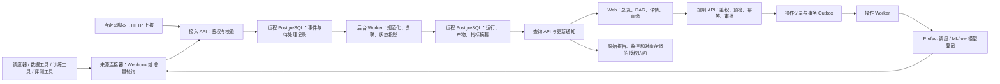

# 技术架构

状态：目标架构 v0.2，已开始开发。当前采用 React/FastAPI 和内存演示适配器，真实持久化与连接器未实现；交付边界见[运行与验收](runtime.md)。

## 1. 总体结构



采用模块化单体，API 和 worker 可独立运行，同一仓库维护。初期不引入微服务、Kafka 或图数据库；只有容量和可靠性实测证明需要时再拆分。

## 2. 技术选型建议

| 层 | 首选 | 原因与边界 |
| --- | --- | --- |
| Web | React + TypeScript + Vite | 与后端解耦，适合运维型工作台 |
| 组件与图表 | Ant Design、React Flow、ELK、Apache ECharts | 复用表格、DAG 布局与成熟图表能力 |
| API | Python FastAPI + Pydantic | 便于对接训练脚本及工具生态 |
| 数据访问 | SQLAlchemy + Alembic | 显式迁移和事务，连接远程 PostgreSQL |
| 异步处理 | 独立 Python worker + PostgreSQL 任务表 | 先控制部署复杂度，支持租约与重试 |
| 指标存储 | PostgreSQL 摘要和低频采样，原系统保留高频数据 | 控制体量和重复建设 |
| 大产物 | 原对象存储 / 模型仓库 | 不上传模型权重到元数据数据库 |
| 实验调度与追踪 | Prefect 3 + MLflow | 前者负责执行生命周期，后者负责参数、指标和产物 |
| 身份认证 | OIDC + 项目级 RBAC | 接公司身份源，具体提供方待确认 |
| 部署 | 容器化，复用现有运行环境 | 本机仅运行应用，数据库始终远程 |

已有团队框架和工具链优先；依赖版本在实施时锁定，并检查许可证。已安装演示依赖并启动本机服务，未创建或查询数据库。

## 3. 领域模型

| 对象 | 关键内容 |
| --- | --- |
| Project | 权限边界、成员、默认关注模板 |
| PipelineDefinition / Version | 流水线身份、不可变定义版本、节点、端口、依赖 |
| PipelineRun | 本次执行、定义快照、负责人、代码与配置摘要、时间、来源 |
| StageRun | 本次执行中的逻辑阶段实例、组件版本、依赖和当前有效尝试 |
| Attempt | 单次执行尝试、外部任务 ID、原始及规范化状态、时间、失败原因 |
| InputBinding / ArtifactBinding | 输入槽位与实际消费版本、生产尝试输出槽位和产物之间的关系 |
| ArtifactVersion | 稳定身份、不可变版本、类型、URI、checksum、摘要、可用性 |
| MetricDefinition / Sample | 语义名、单位、类型、统计窗口、维度、聚合方法、值和时间 |
| QualityResult | 门禁版本、评估对象、结论、证据与评估时间 |
| FocusProfile | 项目或个人关注的指标、产物、阈值、基线及排序 |
| SourceMapping / IngestEvent | 外部 ID 映射、原始事件、幂等键、schema 版本与处理记录 |
| Operation / Outbox | 操作类型、目标修订、幂等键、请求人、参数摘要、外部 ID、实际结果 |
| ApprovalRequest / Decision | 候选版本及证据摘要、策略版本、申请人、审批人、结论和审计 |

实体均受项目作用域约束。涉及外部 ID 的唯一性使用 `(project_id, source_id, external_id)`，不能假设不同工具的 ID 全局唯一。

重要区分：

- 定义不是运行，逻辑阶段不是执行尝试；重试只新增 Attempt，不覆盖历史。
- 控制依赖指“什么条件下允许继续”；数据依赖指“确实消费了哪个版本”。
- StageRun 具有稳定的实例 key；动态展开使用父节点与 shard key 区分实例。
- 每次运行保存图快照；动态发现的节点作为有版本的修订追加，并标记图完整性。MVP 仅显示来源明确提供的节点，不从指标反推结构。
- 复用产物的输入可来自其他运行，但不改变当前运行 DAG 的控制依赖。
- 同一物理产物可有多个引用，规范身份不应是易失效的签名 URL。

## 4. 关联策略

优先在现有调度器启动时生成或传递 `pipeline_run_id`，每个任务附带 `stage_run_id` 与 `attempt_id`，产物使用独立稳定 ID 和版本。

对于暂时不能改造的工具，通过调度器的外部任务 ID 建立明确映射。历史导入必须给出映射清单；不确定的记录进入“待关联”，不得按时间接近自动合并。

绑定输入时同时记录请求版本和实际消费版本。一个重试产生新 checkpoint 后，只有下游上报实际消费该版本，才能建立新血缘；不能因为它是“最新”就覆盖旧引用。

## 5. 异构组件与展示协议

每种组件发布版本化的声明描述：

- 身份：`component_type`、`component_version`、名称、来源类型。
- 输入输出端口：名称、产物类型、是否必需、数量约束、业务 schema。
- 指标声明：语义名、单位、类型、来源字段、维度、采样和聚合规则。
- 状态映射：来源状态到规范状态的映射及权威来源。
- 展示声明：数值、时序、分布、表格、产物清单、报告等白名单 renderer。
- 关注默认值：默认露出的三项指标、关键输出、可选质量门禁。

统一外壳，保留业务字段。未知产物以通用元信息展示；未知指标保留来源名称与单位，不擅自归并。业务 schema 或映射不兼容时升级版本并提示，不静默修改历史口径。

接入一个新工具需实现读取/接收、映射、游标、限流重试、健康检查和来源跳转，不要求修改 DAG 主页面。工具特有交互留在原站。

## 6. 事件接入契约草案

以下为讨论用示例，不是已实现 API；ID 均为虚构。

```json
{
  "schema_version": "1",
  "event_id": "evt-example-001",
  "event_type": "metric.observed",
  "source_id": "training-adapter",
  "source_revision": 42,
  "project_id": "project-demo",
  "pipeline_run_id": "run-demo",
  "stage_run_id": "stage-train",
  "attempt_id": "attempt-2",
  "occurred_at": "2026-09-12T08:00:00Z",
  "payload": {
    "metric_key": "training.tokens_per_second",
    "unit": "token/s",
    "value": 125000,
    "window_seconds": 60,
    "aggregation": "mean",
    "scope": "global"
  }
}
```

`source_revision` 的作用域为来源实体流，非全局计数器；示例事件不会替代更早的其他指标。状态流和不同指标流分别处理，禁止用一个最大序号丢弃所有较旧事件。

建议 API：

| API | 用途 |
| --- | --- |
| `POST /api/v1/events` | 连接器批量提交事件，返回各项已接收、重复或拒绝结果 |
| `GET /api/v1/projects/{id}/runs` | 项目运行筛选与分页 |
| `GET /api/v1/runs/{id}` | 运行摘要、图完整性及数据新鲜度 |
| `GET /api/v1/runs/{id}/graph` | 节点、控制边、输入输出绑定 |
| `GET /api/v1/stages/{id}/attempts` | 尝试记录 |
| `GET /api/v1/attempts/{id}/metrics` | 带口径和下采样信息的指标 |
| `GET /api/v1/artifacts/{id}/lineage` | 有深度、数量及权限边界的血缘查询 |
| `POST /api/v1/runs/{id}/operations/preview` | 预检重跑或终止范围，返回修订号和短时预览凭证 |
| `POST /api/v1/runs/{id}/operations` | 提交带幂等键和预览凭证的操作，返回 202 与 operation ID |
| `GET /api/v1/operations/{id}` | 查询提交、执行、对账及结果状态 |
| `POST /api/v1/runs/{id}/approvals` | 创建绑定候选产物、评测与门禁快照的申请 |
| `POST /api/v1/approvals/{id}/decisions` | 按版本检查提交批准或拒绝，冲突返回 409 |

客户端请求中的 `project_id` 必须与认证授权匹配，不能仅凭字段决定租户。接收成功只代表已持久化，不代表投影完成；提供处理延迟、失败明细和可重放记录。

## 7. 状态与门禁

三条独立状态轴：

- 执行：`pending / queued / running / succeeded / failed / skipped / canceled / unknown`。
- 质量：`not_evaluated / passed / failed / unknown`。
- 新鲜度：`fresh / stale / disconnected`。

等待依赖属于阶段的阻塞原因，记录为独立字段及依赖对象，不混进任务执行状态。失败的某次 Attempt 不等于 StageRun 已失败，若来源仍在重试则明确显示重试中。阶段“当前尝试”优先服从调度器的显式关系，不能只取最新时间戳。

总体状态优先使用权威调度器状态，同时核对节点证据；冲突时展示来源状态及不一致标记。无权威状态时，仅在图已闭合、必需节点均达到定义要求、无待定分支时派生完成，否则保留未知或进行中及推导依据。

“质量失败”和“执行失败”可以独立出现。实验版在评测后将流程挂起等待审批；通过且证据仍有效时才恢复交付，拒绝时关闭交付分支。暂停和恢复委托调度器，不由 Web 请求持有长连接等待审批。

重跑和终止的请求状态独立于任务状态。Prefect 报告 CANCELLING 时显示终止中，不立即写 canceled。若调度器已置 canceled 但无法核验执行进程已退出，保留“调度器已取消 / 资源停止待确认”的区别。操作协议见[实验设计](experiment.md)。

## 8. 可靠性与一致性

1. 接收事件与创建处理任务在同一事务落盘；处理器使用租约和超时回收，允许至少一次执行。
2. `(project_id, source_id, event_id)` 唯一约束保证幂等；同 ID 不同内容作为冲突拒绝并审计。
3. 保留来源事件时间、接收时间、处理时间和实体修订号；时钟不一致时不得只按客户端时间回滚状态。
4. 状态更新遵循来源实体的修订号和显式状态修正事件。没有可靠版本的轮询来源串行采集并定期做权威快照核对。
5. 事件和指标样本可乱序追加，状态投影不可由过期事件回退；历史回补不覆盖当前状态。
6. 先到的产物消费事件可进入待解析，生产者补齐后关联；页面明确显示未解析依赖。
7. 连接器采用退避、限流、增量游标和周期性对账；游标在对应批次持久化完成后推进。
8. 连续失败进入隔离记录，保留脱敏原因及人工重放入口；上游停机不能拖垮查询服务。
9. 所有写入产生结构化日志并实时落盘或进入现有集中日志服务，禁止在日志中记录凭据。
10. 操作、审批状态变更和 Outbox 消息同事务提交。外部请求超时进入结果待确认，先按幂等键/外部 ID 对账，不盲目创建第二个训练任务。
11. 审批使用目标修订号及 compare-and-swap，发出交付命令时再次检查证据摘要、取消标记和批准有效性。终止与审批并发通过同一运行的事务锁协调，已发出的执行仍须向来源发送取消并核验。

## 9. 容量、保留与目标

先按试点设计：单项目最多 100 条活跃运行，单次可见 DAG 最多 200 个节点实例，每节点选择不超过 10 条低频指标。更大的动态任务先按阶段汇总，再分页查看实例。

试点关注曲线可每 60 秒一个点；100 个同时采集的节点、每节点 10 个指标约产生 144 万点/天。这只是示例负载，不是全部节点长期满载的容量承诺。按运行和时间建立索引，采样表按需分区，接口限制点数并保留降采样方法。

候选保留策略：原始接入事件 30 天、低频曲线 30 天、运行摘要和血缘 180 天；审计记录按公司政策。保留期间数据规模须据实际活跃节点数估算；超出预算优先减少采集或复用原指标后端。过期后仍保留必要产物身份和血缘墓碑，明确数据缺口。

以下均为待验证目标：

- 事件接收至页面可见 P95 不超过 15 秒；轮询来源单独展示 30 至 60 秒采集周期及实际延迟。
- 试点约定规模下，运行列表与摘要接口 P95 小于 1 秒，缓存与冷查询分别测量。
- 重放、重复、乱序、重试、来源断连和越权场景必须通过集成验证。

应用本身监控接入延迟、处理积压、投影失败、未关联记录、来源健康、查询时延和权限拒绝。不将平台采集延迟计入训练执行耗时。

## 10. 安全与部署约束

- 项目角色建议为 viewer、operator、approver、admin；配置编辑单独授权。operator 可重跑和终止，approver 可审批但不能自批，admin 不自动绕过审批。采集身份和控制身份分离并限制到项目。
- 列表、单对象、血缘遍历、指标、导出及后续通知均校验权限。跨项目依赖不泄露无权访问的对象名和内容。
- 凭据放在环境变量或远程密钥服务，不进 Git，不进普通元数据 JSON，不直接返回前端。
- 对象访问先做平台权限检查，再使用原存储授权或短时签名；不能把公开 URL 当作权限控制。
- 不从任意用户 URL 抓取内容。连接器目标采用管理员配置的允许列表和出口限制，防止 SSRF。
- 报告清洗并隔离渲染；禁止执行训练产物中的 HTML 脚本，不加载任意第三方展示插件。
- 不存明文敏感配置和数据样本；摘要也需分级、脱敏，日志内容默认留在来源系统。
- 开发、集成测试和部署均使用已授权的远程 PostgreSQL。迁移或回补必须针对确认过的环境，不查询本地数据库。
- 备份、恢复演练、RPO/RTO、保留周期和删除政策需在生产发布前明确。
- Prefect 和 MLflow 同样显式使用远程服务及远程数据库，禁止回落到本地 SQLite 或默认本地 tracking backend。未配置时直接报告缺少环境。
