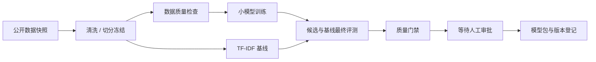

# 实验链路与操作设计

状态：讨论稿 v0.2。用户已授权选择公开工具并要求重跑、终止、审批；本文给出实施基线，不代表功能已经实现。

## 1. 实验任务与工具

采用 AG News 四分类文本任务和 `distilbert/distilbert-base-uncased`，先在固定的小样本子集上微调。它能产生数据表、训练曲线、checkpoint、混淆矩阵、评测报告和模型包，比直接建设大模型训练集群更适合验证平台。数据集、模型 revision 和依赖版本必须在实施时固定并记录许可与来源，不将“公开可下载”视为无限制再分发。

建议试点配置：从训练集固定抽取 2,000 条训练样本、500 条验证样本，从官方测试集固定抽取 500 条最终评测样本，种子 42，最多 1 epoch，最大序列长度 128。它是平台功能实验，不用于宣称模型达到生产质量。CPU 可执行但耗时需实测，GPU 可选，不自动申请付费资源。

先对整个选定样本集做标准化 hash 去重及跨 split 重叠检测，再冻结数据。调参只看验证集，最终测试集不参与候选选择；选择规则和最终评测次数进入报告。

| 工具 | 职责 | TrainVista 接入方式 |
| --- | --- | --- |
| Prefect 3 | DAG 执行、重试、挂起、恢复、取消 | API 轮询 / 事件、预配置 deployment 操作 |
| Hugging Face Datasets | 读取公开数据、确定 revision、冻结样本 | 脚本上报 manifest 和阶段事件 |
| Transformers + PyTorch | tokenizer、训练、保存 checkpoint | callback 上报，MLflow 保存参数和曲线 |
| scikit-learn | accuracy、macro-F1、分组指标、混淆矩阵 | 版本化 JSON 指标及报告产物 |
| MLflow | 实验参数、指标、产物引用、模型版本登记 | Tracking / Registry API |
| 远程 S3 兼容存储 | 数据 manifest、checkpoint、报告、模型包 | 不可变对象 key 和校验值 |

首版不额外引入 Ray、Kubeflow、Spark、DVC 或独立时序数据库；后续接入通过相同组件协议扩展。数据版本以来源 revision、切分样本 ID 和内容 hash 共同确定，MLflow run ID 不充当数据版本。

## 2. 端到端流程

| 阶段 | 输入 | 输出 | 默认三个关注值 |
| --- | --- | --- | --- |
| 数据快照 | 数据集 revision、抽样配置 | 原始样本、来源 manifest | 样本数、读取速率、失败数 |
| 清洗冻结 | 原始样本、规则版本 | 固定 train/validation/test manifest | 有效样本数、去重比例、耗时 |
| 数据检查 | 固定 split | 分布表、检查报告 | 跨集重复数、空文本数、标签有效率 |
| 训练 | train/validation、模型 revision、配置 | checkpoint、配置、曲线 | 验证 loss、samples/s、已完成 step |
| 基线 | 同一 train/validation | TF-IDF + LogisticRegression 模型 | 验证 macro-F1、样本数、耗时 |
| 最终评测 | 两个模型、固定 test、评测配置 | 指标表、混淆矩阵、差异报告 | macro-F1、相对基线变化、accuracy |
| 门禁 / 审批 | 指标、产物与策略快照 | 结论、申请和审计记录 | 是否达标、待审时长、证据完整性 |
| 交付 | 已批准 checkpoint、配置和报告 | 模型包、模型卡、MLflow 版本 | 包完整性、登记结果、版本号 |

实验门禁示例：空文本数与跨 split 重复数为 0、标签有效率为 100%；模型 macro-F1 至少 0.80、相对同条件基线下降不超过 0.01（一个百分点），产物校验齐全。阈值是可版本化的实验规则，不是已达到的结果；门禁失败时不开放批准，修改阈值必须生成新策略和新申请。

## 3. Leader 首屏筛选依据

首屏指标必须能够驱动“介入、等待、放行”之一，且有可追溯证据。不将训练次数、GPU 数或 loss 最低值等仅描述活动量的数字作为核心结论。

| 优先级 | 信息 | 为什么重要 | 最小呈现 |
| --- | --- | --- | --- |
| 1 | 待介入风险 | 直接决定负责人现在需要做什么 | 阻塞原因、责任人、影响运行/下游、等待时长、处理入口 |
| 2 | 候选模型交付就绪度 | 流程成功不代表产物可用 | 候选版本、质量门禁、基线差值、产物完整性、审批状态 |
| 3 | 阶段进展与耗时 | 解释当前正在做什么、为何还没完成 | 阶段条、当前节点、已用时、排队/执行/待审拆分 |
| 常驻 | 数据可信度 | 防止依据过期状态做判断 | 来源与最后更新时间，失联提示 |

桌面首屏采用紧凑摘要带、待处理列表和运行表，不用四张大数字卡片挤走真实流程。默认对最近 24 小时创建的运行加上所有未结束运行去重显示，范围在页面明确标注。候选由项目负责人显式选择，始终显示所属运行，不自动切换为“最好成绩”。

风险排序：交付完整性/质量阻断 > 必需阶段失败 > 超期审批或排队 > 来源失联；同级按影响运行数和持续时间排序。一个根因阻塞多个下游时合并呈现，仍列出影响范围。排序规则可解释，不声称是 AI 根因分析。

数据失联即使排列在列表后方，也会在对应运行显著标明，相关控制操作必须重新向来源校验。交付就绪度不是模糊百分比，而是“质量通过、产物完整、审批通过、来源已核验”四个独立条件；训练中或无候选时显示尚未形成。

不显示未经验证的预计完成时间。累计至少 10 条同配置和资源档位的成功记录后，可展示剩余耗时参考区间并注明样本数，不能承诺 deadline。

历史成功率放在稳定性页，样本数、排除项和时间窗口同时显示。吞吐只有相对同配置同资源基线持续下降且数据充分时才触发风险，默认不把 CPU 与 GPU、不同 batch size 的吞吐直接相比。

## 4. 手动重跑

首版支持整条重跑及从“训练”或“评测”开始重跑两个受控检查点，任意节点重跑后置。

1. operator 选择范围并填写原因，服务端计算执行闭包、复用输入和预计资源档位。
2. 预览冻结定义版本、代码版本、输入 manifest、checkpoint 和配置。默认复用原配置；允许调整的训练参数通过类型、范围与预算校验，不接受 shell 字符串。
3. 若必要输入不存在、校验失败、无权限或来源不支持则拒绝；不能默默使用最新版本。
4. 用户确认后，以幂等键创建 Operation 和新的 PipelineRun，记录 `rerun_of`、新旧配置差异及复用输入。
5. 新运行的复用节点显式标为 `reused` 展示属性及产物引用，不伪造执行时间。整条重跑不会自动删除旧产物。
6. 原运行保持不变；尚在运行时的克隆须显式确认额外资源使用，默认禁止同范围并发重跑。

自动失败重试由 Prefect 负责，记录为原 StageRun 下的不同 Attempt；用户主动重跑则创建新 PipelineRun。审批结论绝不跨新运行继承，哪怕最终文件内容相同。

## 5. 终止

首版终止范围为整条运行，不提供任意子任务单独 kill。确认框展示运行 ID、活跃阶段、下游、可能保留的部分产物以及资源释放的不确定性。

- 提交前读取来源最新状态并检查目标修订。已自然完成的运行返回“已完成，无需终止”，不改写成取消。
- 首先记录取消意图，阻止尚未提交的交付操作，再通过 Prefect 请求 CANCELLING。
- Prefect deployment 的 worker 必须在线并支持对应基础设施取消；不能对没有部署管理的任意脚本承诺终止。
- 请求进入“终止中”；来源取消完成和进程/容器/Job 消失分别核验。若超时只保留“结果待确认”，不宣称已停止或自动重复 kill。
- checkpoint、报告等已经生成的产物保留，标注完整/部分/未知，不自动删除。
- 终止与完成竞争时保存真实终态和操作结论，例如“终止前已完成”；终止不得推翻已完成的审批审计。

已向外部系统发出的登记不能靠数据库事务回滚。若终止时版本登记已发生，记录版本 ID、取消未完全生效和人工处置入口；第一版交付仅生成不可变实验版本，不切换生产别名或上线服务。

## 6. 审批与交付

审批对象为候选版本的证据快照，不是流水线名称。快照至少包含 checkpoint digest、数据 manifest、代码和配置 hash、评测报告 digest、门禁策略版本、目标运行修订。

- 门禁通过后创建申请，Prefect 流程挂起并释放执行资源，等待平台批准后恢复；部署需支持持久化和恢复。
- 角色划分为 viewer、operator、approver、admin。审批人与申请人必须不同；实验环境使用两个独立的演示身份验证流程，真实模式不能信任前端随意提交的角色。
- 首版单人审批，结论为批准或拒绝并附意见。批准通过 CAS 从 pending 迁移，重复点击幂等；并发不同结论返回冲突。
- 申请默认 24 小时过期；过期、取消、证据变化后不允许交付，需创建新的有效申请。
- 拒绝关闭本次交付分支，运行可显示“训练评测完成 / 交付被拒绝”，不强行把训练状态改成失败。
- 交付 worker 再次检查身份授权、批准有效性、门禁和内容 digest。调度器仅在验证成功后恢复交付；恢复超时先对账。
- 执行侧交付任务也必须向平台验证批准和取消意图，不能信任 Prefect UI 的手动恢复或输入中的布尔批准。连接器账户限制外部恢复/登记权限；平台不可达时交付失败关闭。
- 如果 worker 在执行重试，必须使用同一交付幂等标识，按外部版本记录核对，避免重复登记。

审批的申请、决定、取消与 Operation 的分发均按目标运行加事务锁。终止优先禁止新的交付分发；已经在外部执行的命令需要取消和核验，不能承诺跨系统原子事务。

## 7. 操作通用契约

预检返回短时凭证，包含目标、修订、执行计划摘要和失效时间，不能仅由前端拼装。提交必须携带 `Idempotency-Key`、预检凭证和理由，服务端重新校验权限与状态。

Operation 状态为 `requested / dispatching / accepted / reconciling / succeeded / failed / canceled / unknown`，独立于训练状态。记录原始请求、授权主体、目标版本、外部 ID、结果证据和时间线；敏感参数只保留脱敏摘要。

同项目、同请求主体、同幂等键必须得到同一结果；同键不同请求体返回 409。事务 Outbox 至少一次投递，外部创建有幂等支持时使用其能力，无幂等保证的连接器在结果不明时暂停并对账，不自动重复创建。训练重跑操作成功表示新运行已确认创建，不表示训练已完成。

## 8. 实现顺序与演示边界

1. 契约与页面原型：使用显式标注的模拟事件覆盖成功、阻塞、重试、失联、取消和审批；此模式不访问数据库或伪装真实执行。
2. 真实最小链路：配置远程 PostgreSQL、Prefect、MLflow 和对象存储，跑小样本 CPU 实验，核验血缘及回补。
3. 控制闭环：启用真实重跑、终止、审批和交付，验证幂等、并发、进程退出及权限。

当前仍在文档阶段，不启动上述实现。真实模式缺少远程依赖时直接提示配置缺失，不回落到本地 SQLite、MLflow 本地存储或虚构执行结果。

## 9. 公开依据

- [Hugging Face 文本分类指南](https://huggingface.co/docs/transformers/tasks/sequence_classification)
- [AG News 数据集](https://huggingface.co/datasets/fancyzhx/ag_news)
- [DistilBERT 模型](https://huggingface.co/distilbert/distilbert-base-uncased)
- [Prefect 工作流取消](https://docs.prefect.io/v3/advanced/cancel-workflows)
- [Prefect 人工介入工作流](https://docs.prefect.io/v3/advanced/interactive)
- [MLflow Tracking](https://mlflow.org/docs/latest/ml/tracking/)
- [scikit-learn 分类指标](https://scikit-learn.org/stable/modules/model_evaluation.html#classification-metrics)

取消、人工介入和 Tracking 行为已按官方页面核对；依赖版本、资源释放、恢复机制及具体 API 在实现时针对选定版本做集成验证。
