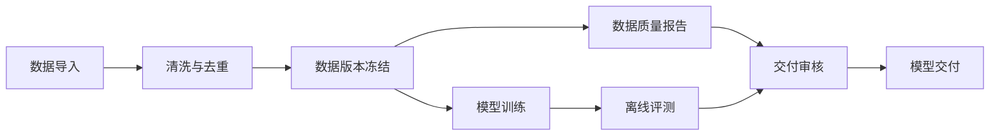

# 产品方案

状态：目标方案 v0.2，用户已批准开发。v0.1 演示实现已交付，具体边界见[运行与验收](runtime.md)；本文完整范围不等于所有真实接入均已完成。

## 1. 定位与边界

TrainVista 是训练生命周期的统一观察、追踪与受控操作层，面向跨工具、跨阶段、输入输出异构的流水线，回答五个问题：

1. 本次训练整体进展如何，最终交付是否可用？
2. 哪个阶段正在运行、等待或失败，影响哪些下游？
3. 各阶段实际消费了哪些版本，产出了哪些结果？
4. 效率、稳定性和模型质量是否达到关注目标？
5. 异常由谁负责，原始任务、日志和报告在哪里？

第一版支持重跑、终止和审批，但不自建调度器、拖拽式任务编排、训练平台、全量日志平台或模型托管服务。操作通过鉴权、确认和审计后交给现有调度器。流程图来自已有定义或显式上报，不通过相近名称和时间自动猜测依赖。

与现有工具的关系：保留训练实验追踪、监控和流水线系统的专业能力，用连接器汇聚必要信息并提供原站跳转。实验版采用公开工具，具体链路见[实验设计](experiment.md)。

## 2. 用户与关注点

| 用户 | 核心问题 | 默认入口 |
| --- | --- | --- |
| Leader / 项目负责人 | 哪些训练有风险，哪个阶段卡住，最终质量如何 | 项目总览、关键里程碑、异常列表 |
| 算法工程师 | 输入、配置、checkpoint 和评测结果能否对上 | 单次运行、产物血缘、可比运行 |
| 平台工程师 | 吞吐下降、重试、排队和资源使用发生在哪里 | 阶段详情、尝试记录、来源监控 |
| 数据 / 评测负责人 | 数据版本是否正确，质量检查是否通过 | 数据与报告详情、质量门禁 |

“关注点”是明确的配置对象，不只是收藏：关注范围、指标及口径、展示优先级、基线、阈值、持续时间和责任人。个人关注与团队默认视图分开保存；关注配置不能扩大数据访问权限。

示例：Leader 关注最终评测是否达标、失败阻塞、总耗时；训练负责人关注 tokens/s、loss、重试次数；数据负责人关注有效样本量、去重率和数据版本。

## 3. 完整流程示例

以下为通用领域示例；实验实例采用公开数据的小模型文本分类，不依赖用户提供内部系统。

流程必须支持分支、汇合、条件跳过、并行、重试和复用既有产物。模型迭代或循环表现为不同运行及其关联，不在单次 DAG 中制造环。图中顺序是控制依赖，具体哪个输入来自哪个输出由产物连线表达。

| 阶段 | 典型输入 | 典型产物 | 关键值 | 展示形式 |
| --- | --- | --- | --- | --- |
| 数据导入 | 数据源快照、抽取规则 | 原始数据版本、清单 | 数据量、导入速率、错误率 | 数值、表格 |
| 清洗与去重 | 原始数据、规则版本 | 清洗数据、质量报告 | 保留率、重复率、处理吞吐 | 趋势、分布、报告 |
| 数据冻结 | 清洗数据、切分配置 | 不可变数据集版本 | 样本数、token 数、切分比例 | 版本与摘要 |
| 模型训练 | 数据版本、代码版本、配置、初始权重 | checkpoint、训练摘要 | loss、tokens/s、GPU 利用率 | 曲线、产物列表 |
| 离线评测 | checkpoint、评测集版本、评测配置 | 指标表、案例、评测报告 | 分任务得分、通过率、延迟 | 对比表、分布、报告 |
| 模型交付 | 通过评测的权重、审核记录 | 模型包、模型卡、注册记录 | 完整性、审批状态 | 清单、状态时间线 |

吞吐单位、评测指标、产物数量均可因组件而异；没有某项数据时显示“未采集”或“不适用”，不能填零。

## 4. 页面结构

### 4.1 项目总览

- 首屏按决策重要性排列：待介入风险、候选交付就绪度、运行阶段与阻塞，不以历史成功率或 GPU 指标作为主视觉。
- 待介入区列出失败阻塞、等待审批、超时和采集失联，展示责任人、等待时长、影响范围及可执行动作。
- 候选交付区显示明确候选版本的质量门禁、相对基线变化、产物完整性和审批状态，不自动挑选最好的一次充当候选。
- 主体为可筛选的紧凑运行表：运行、阶段条、首要阻塞、已用时、质量、下一步、负责人、数据更新时间。点击运行进入完整 DAG。
- 吞吐下降只有在同口径持续退化并影响进展时才升级为风险；历史成功率和详细技术曲线放在次级视图。
- 时间范围、流水线、负责人和标签可筛选；空状态不显示虚构样本。
- 不在总览强行合并不同单位的吞吐，也不平均不同评测集的得分。

### 4.2 单次运行

- 页头提供运行 ID、配置和代码版本、负责人、来源、起止时间、三类状态。
- 主区为 DAG，阶段节点显示状态、持续时间、最多三个关注值、产物数量。
- 图支持缩放、定位异常和突出上游原因及受影响下游；复杂图提供阶段列表替代视图。
- 点击节点打开详情侧栏，保留流程上下文；详细分析进入独立详情页。
- 并列提供时间线，展示事件、重试、门禁结论和产物可用时间。
- 只在有可靠总工作量时给阶段进度。整体默认显示“已完成必需节点数 / 已知必需节点数”，并注明图是否完整，不冒充工作量百分比。

### 4.3 阶段详情

固定提供“概览 / 输入输出 / 指标 / 尝试记录 / 来源链接”五个页签。

- 概览：责任人、执行状态、质量结论、等待原因、依赖和新鲜度。
- 输入输出：输入端口、期望类型、实际版本、来源尝试、产物可用状态。
- 指标：按组件声明的类型展示数值、曲线、分布、表格，不接收任意可执行前端代码。
- 尝试记录：首次失败和后续成功均保留；默认展示当前有效尝试，允许显式切换。
- 来源链接：原始任务、监控、实验与日志地址；受原系统权限约束。

### 4.4 产物详情与血缘

显示稳定产物 ID、不可变版本、类型、校验值、产生者、消费记录、位置和保留状态。

从评测报告能够追溯 checkpoint、训练尝试、数据版本、代码与配置；跨运行复用保留原始生产者，不重复伪造产出。报告预览仅支持白名单类型和隔离渲染；不能安全预览时提供授权跳转。

### 4.5 关注与对比

MVP 提供团队默认关注模板和个人筛选保存，不做复杂规则编辑器。二期再支持通知订阅、基线趋势和运行对比；仅在指标定义、单位、评测集和采样口径一致时允许直接对比。

### 4.6 受控操作

- 重跑：预览执行范围、复用输入版本和新增运行；手动重跑始终保留原运行，自动重试仍记录为 Attempt。
- 终止：确认具体运行、活跃任务及影响，请求后显示终止中，等待调度器和执行基础设施确认。
- 审批：在锁定的模型、评测报告与门禁快照上批准或拒绝；审批人不能批准自己的申请，拒绝不等于删除训练成果。
- 所有操作都需要后端权限校验、理由、幂等键和操作结果查询；不支持的来源隐藏或禁用入口并给出原因。
- 首版不允许任意修改脚本或 shell 参数。详细协议及并发规则见[实验设计](experiment.md)。

## 5. 统一指标口径

| 指标 | 建议定义 | 禁止的误用 |
| --- | --- | --- |
| 执行成功率 | 按运行创建时间选定 cohort，成功运行 /（成功 + 失败运行）；旁列在途、取消和排除数量 | 把重试次数当独立运行；隐藏尚未结束样本 |
| 质量通过率 | 已完成评估且通过 / 已完成评估数量；未评估单列 | 把进程退出成功当成模型质量通过 |
| 阶段吞吐 | 明确对象、单位、统计窗口和聚合方式 | 将 samples/s 与 tokens/s 相加 |
| 端到端耗时 | 运行结束时间减创建时间；活动运行显示已用时 | 用各节点耗时相加代替并行流程耗时 |
| 排队 / 执行耗时 | 分别取调度提交、实际开始、结束等权威时间戳 | 缺时间戳时推断为零 |
| 数据新鲜度 | 最后成功观测时间与配置的刷新周期比较 | 把采集器故障当成任务失败 |

吞吐汇总必须确认是否为互斥工作分片、同步窗口及本地值/全局值，避免重复累加训练框架已聚合的指标。跨数据源口径无法对齐时并排展示而非生成单一总分。

## 6. MVP 范围

必须包含：一条可实际执行的公开实验流水线、Prefect 和 MLflow 两种来源、项目运行表、单次 DAG、阶段详情、版本化产物引用、基础血缘、配置式关键指标、重试记录、采集状态、项目级访问控制、来源跳转，以及重跑、终止、审批和审计。

暂不包含：拖拽编排、任意流程脚本编辑、复杂告警、多租户计费、成本预测、自动根因推断、任意插件代码、完整日志存储、全量高频训练曲线迁移。

实验链路采用已选定的公开工具。接入真实执行前需配置远程服务和账户权限；无服务的演示模式明确标为模拟，不能宣称执行了真实重跑或终止。

## 7. 验收场景

| 场景 | 验收要求 |
| --- | --- |
| 正常完成 | 从运行入口查到各阶段状态、输入版本及最终报告，关联 ID 一致 |
| 上游失败 | 可区分失败节点与等待节点，并显示依赖路径和影响范围 |
| 失败后重试 | 尝试历史不丢失，新旧 checkpoint 不串联，后续消费绑定正确版本 |
| 数据缺失 | 未采集指标不显示零，未绑定输入不被标为可用 |
| 采集断开 | 显示来源更新中断，保留最后观测状态，不推断训练失败 |
| 质量未通过 | 执行成功仍可显示质量失败；下游是否阻塞取决于实际门禁规则 |
| 条件分支 | 未选分支显示跳过及原因，不计为失败 |
| 产物失效 | 标记删除或不可访问，保留元信息与血缘，不显示有效下载 |
| 越权访问 | 列表、搜索、详情、事件流、血缘和下载链接均按项目权限过滤 |
| 手动重跑 | 创建关联的新运行；复用输入显式冻结，历史运行和审批不被覆盖 |
| 终止超时 | 请求成功不能直接标成进程已停止；显示未知结果并支持对账 |
| 审批竞争 | 两人同时审批只接受一次有效状态变更，保留两次请求的审计 |
| 审批后变更 | 模型、评测或策略版本变化使旧批准不适用于新交付 |

建议的试点评估目标：Leader 在 30 秒内识别当前阶段及首要风险；在三步导航内定位某次评测对应的数据版本。性能目标见架构文档，均须实测验证。
